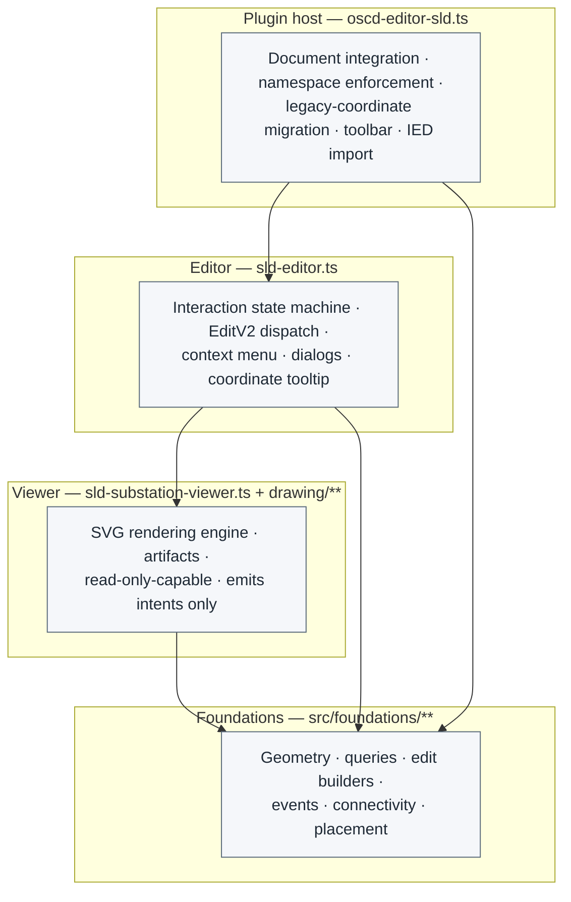
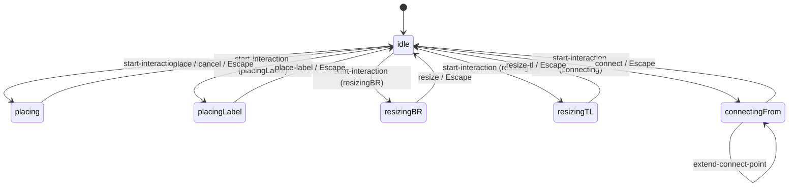

# Architecture

## 1. The big picture

### Two reciprocal types

The whole editor/viewer is organised around a pair of reciprocal types that flow in opposite directions:

- **`InteractionIntent`** — flows **viewer → editor** ("the user wants to _start_ placing this element"). Dispatched by the viewer, it carries no document edit; it is a _request_.
- **`InteractionState`** — flows **editor → viewer** ("you are now in `placing` mode"). Owned by the editor, projected down to the viewer so the viewer can render the in-progress gesture.

The viewer **dispatches intents** and **reacts to state**. The editor is the state machine in the middle: it consumes intents, decides the next state, and — when an interaction completes — translates it into a document edit.

### The three building blocks

Read bottom-up — each block is built on the one before it.

1. **`sld-substation-viewer`** (the core). A standalone web component that renders an SLD diagram from an SCL document whose layout lives in its `<Private>` sections. It is **interaction-oriented**: it dispatches interaction intents (the user clicked the grid, dragged a connection) and reacts to the interaction state it is given (default `locked` — a truly static read-only diagram; put it into `placing` and it hides the original artifact and renders a preview following the cursor). It **does not** translate interactions into document edits. On its own, it is a read-only SLD viewer.

2. **`sld-editor`** (built on the viewer). Also a web component usable independently of the plugin — for both viewing _and_ editing. It reacts to the viewer's interaction intents and acts as the **state machine** for the interaction state. When an interaction resolves, it translates it into an `EditV2` event and dispatches it **upwards** to its host.

3. **`oscd-editor-sld`** (the plugin host). The OpenSCD plugin shell. It owns the document, enforces the SLD namespace on every edit, runs the legacy-coordinate migration gate, and hosts the toolbar. It applies the `EditV2` edits the editor emits.



| Tier | Entry point | Responsibility |
| --- | --- | --- |
| **Plugin host** | `src/oscd-editor-sld.ts` (`OscdEditorSld`) | The OpenSCD plugin. Owns the `doc`, enforces the SLD namespace on every child edit, runs the legacy-coordinate migration gate, hosts the toolbar and IED import, and applies edits. |
| **Editor** | `src/sld-editor.ts` (`SldEditor`) | The interaction state machine. Owns `interaction: InteractionState`, translates interactions into `EditV2` edits and dispatches them upward, and hosts the singleton overlays. |
| **Viewer** | `src/sld-substation-viewer.ts` (`SldSubstationViewer`) + `src/drawing/**` | The rendering engine. Draws the substation and any in-progress gesture it is handed. Emits only intent events — never `EditV2`. Read-only capable. |

**Foundations** (`src/foundations/**`) are not a tier — they are the leaf utilities every tier draws on: pure geometry, SCL queries, edit builders, the event vocabulary, connectivity, placement rules. They are deliberately split so that _query/render_ helpers and _edit builders_ live in separate modules (see §6, and the dependency rule in §3).

---

## 2. The interaction boundary

This is the seam between the viewer and the editor. It is deliberately asymmetric:

- **Intents flow up** (viewer → editor) as plain `CustomEvent`s. **None of them carry an `EditV2`.**
- **State flows down** (editor → viewer) as the single `interaction` value.
- **Edits flow further up** (editor → host) as `EditV2` events. The editor is the _only_ tier that constructs and dispatches edits.

### Design principle: exactly one state at a time

`InteractionState` is a discriminated union keyed on `mode`, so **the editor can only ever be in one interaction state at a time**. Placing _and_ resizing simultaneously is not an inexpressible bug to guard against — it is _unrepresentable_. `idle` is the editor's resting state; every gesture begins from it and resolves back to it. The union also carries `locked` — the viewer's read-only default, covered in §3.



### Intents, and the state they cause

Every viewer intent is an `oscd-sld-*` event (bubbling + composed). They fall into three groups by what the editor does with them.

**Group A — begin a gesture.** The single `oscd-sld-start-interaction` event carries an `InteractionIntent`; `SldEditor.handleStartInteraction` switches on it and sets the corresponding `InteractionState`. No edit is produced.

| Intent (`InteractionIntent.mode`) | Resulting `InteractionState` |
| --------------------------------- | ---------------------------- |
| `placing`                         | `placing`                    |
| `placingLabel`                    | `placingLabel`               |
| `resizingBR`                      | `resizingBR`                 |
| `resizingTL`                      | `resizingTL`                 |
| `connecting`                      | `connectingFrom`             |

**Group B — complete a gesture → produce an `EditV2`.** These fire when the user commits (drops a placement, finishes a resize, closes a connection). The editor builds the edit, dispatches it upward, and (for the mode-ending ones) returns to `idle`.

| Intent event | Editor handler | Effect |
| --- | --- | --- |
| `oscd-sld-place` | `handlePlace` | insert/move `EditV2` → `idle` |
| `oscd-sld-place-label` | `handlePlaceLabel` | label-move `EditV2` → `idle` |
| `oscd-sld-resize` | `handleResize` | resize `EditV2` → `idle` |
| `oscd-sld-resize-tl` | `handleResizeTL` | top-left resize `EditV2` → `idle` |
| `oscd-sld-rotate` | `handleRotate` | rotate `EditV2` |
| `oscd-sld-connect` | `handleConnect` | connectivity `EditV2` |
| `oscd-sld-ground-terminal` | `handleGroundTerminal` | ground `EditV2`, or a warning if not groundable |
| `oscd-sld-extend-connect-point` | `handleExtendConnectPoint` | appends a point; stays in `connectingFrom` |
| `oscd-sld-edit-scl` | `handleEditScl` | opens SCL dialog → `EditV2` |
| `oscd-sld-edit-ied` | `handleEditIed` | opens IED dialog → `EditV2` (+ SLD reference sync) |

**Group C — pure notifications.** `oscd-sld-open-context-menu` opens the editor's context-menu overlay (no edit). `oscd-sld-selected` is _not_ consumed by the editor at all — it bubbles out (composed) as a selection signal a host may react to or ignore.

The reciprocal pair lives in two files on purpose: `InteractionState` (controller-owned, includes `idle`) in `foundations/interaction-mode.ts`; `InteractionIntent` (the begin-transitions only, no `idle`) in `foundations/events.ts`. Same `mode` discriminants, opposite directions, distinct types — so illegal states are unrepresentable in production _and_ in tests.

---

## 3. The viewer tier

`sld-substation-viewer.ts` + `src/drawing/**`. The rendering engine, and the reusable read-only core.

### `locked` ⇒ a truly read-only viewer

The viewer has **two** gesture-less resting states:

- **`locked`** (the viewer's **default**) — a completely static diagram. Every interaction overlay _and_ every editing affordance is suppressed: no connect ports, no resize handles, no context menus, no click-to-place targets, nothing dispatches. A bare `<sld-substation-viewer>` is read-only by nature; you have to opt _into_ editing.
- **`idle`** — the editor's _ready_ resting state. The in-progress-gesture overlays (placing preview, connection preview, resize handles, hover highlights, label-reposition preview) render `nothing`, but the affordances that _begin_ a gesture (ports, click-to-place, context menu) are live, because the editor needs them to start the next interaction.

Both gate on the interaction mode. In `locked` **and** `idle`:

- the in-progress-gesture overlay layers render `nothing`,
- artifacts render their static SVG only,
- the viewer still emits `oscd-sld-selected` / `oscd-sld-open-context-menu` as pure notifications a host may ignore.

`locked` goes further: the affordances that `idle` keeps live (ports, click-to-place, connectivity-node picks) are gated off too, so nothing in the diagram is pointer-interactive and no intent can be dispatched. So the viewer, left at its `locked` default, is a **truly static read-only renderer** — no editing code is loaded or reachable. Its public surface is small:

```ts
// SldSubstationViewer — the reusable renderer
doc: XMLDocument; // the SCL document
substation: Element; // the <Substation> to draw
docVersion: number; // bump to invalidate memoized layers
interaction: InteractionState; // default { mode: 'locked' } → read-only; the editor drives it to idle + gestures
selectable: string[]; // ids eligible for selection highlight
highlight: { id; style }[]; // externally-driven highlight overlay
showLabels?: boolean;
showIeds?: boolean;
```

Another plugin (e.g. a communications editor that overlays its own SVG on the diagram) can drive this renderer read-only and layer its own content on top — the future-packaging goal (§7).

### The dependency rule

The viewer tier stays reusable because of one rule:

> **The viewer never depends on the editor, and never builds or dispatches a document edit.** It emits intents (§2); the editor turns those into `EditV2`.

Foundations that would otherwise mix concerns are split so this holds: a `foo.ts` holds queries and primitives (viewer-safe), and a sibling `foo-edits.ts` holds the `EditV2` builders (editor-only).

| Query module (viewer-safe) | Edit-builder module (editor-only) |
| --- | --- |
| `sld-attributes.ts` — `getSLDAttributes`, `attributes` | `sld-attribute-edits.ts` — `updateSLDAttributes` |
| `ied.ts` — `iedReferences`, `resolveIed` | `ied-edits.ts` — `createRemoveIedReferenceEdit` |
| `connectivity.ts` — `isBusBar`, `connectionStartPoints` | `connectivity-edits.ts` — `removeNode`, `removeTerminal`, `reparentElement` |
| `sld-placement.ts` — `canPlaceAt`, `canResizeTo` | `edits.ts` — ground / flip / delete / connect / resize / rotate builders |

### Artifacts

Each SLD element kind is drawn by a functional **artifact** in `src/drawing/artifacts/**` (`conducting-equipment`, `power-transformer`, `bus-bar`, `connectivity-node`, `equipment-container` for `VoltageLevel`/`Bay`, `ied-reference`, plus shared `label` and `highlight` helpers).

An artifact is a descriptor with four pure functions over an element and a **context** (`SldArtifactDescriptor` in `artifacts/artifact.ts`):

- `matches(element)` — the viewer calls this to find the one artifact that draws a given element (the artifact registry is a `matches`-based lookup).
- `state(element, context)` — derives this element's **render state**: its geometry (position/size), a transformer's windings, whether it is selected or highlighted, and so on. It reads `context.interaction` but returns the artifact's own view-model, _not_ the `InteractionState`. Returns `undefined` when there is nothing to draw.
- `actions(element, context, state)` — returns this element's event handlers (click, pointer, context-menu). Which handlers you get is decided from the context — chiefly the interaction mode and whether the viewer is `disabled` or the element is `selectable` — so an idle click may begin a placement while a disabled click only selects. The handlers only ever `dispatch` `oscd-sld-*` intents; they never build or dispatch an `EditV2`.
- `render(element, state, actions, context)` — produces the SVG from the state and wires the actions onto it.

The **context** is where the viewer hands the artifact everything it needs without the artifact reaching back up the tiers. The shared base (`SldSharedContext`) carries: `interaction` (the current gesture), `dispatch(event)` (how an artifact emits an intent), grid-position helpers (`gridPosition` / `halfGridPosition`), `renderedPosition` / `renderedLabelPosition`, `resolveIed`, the `selectable` set, the `substation`, the `view` flags (`showLabels` / `showIeds`), and `disabled`. Anything used by a single artifact lives in that artifact's own context type, which extends the base — not in the shared context.

### One `render()`, interleaved z-order

The viewer draws base topology **and** in-progress overlays from a single `render()` in a single SVG. Overlays are _interleaved into the base layer's z-order_ (a voltage-level placing target paints _behind_ the base voltage level; a connection preview paints _between_ voltage levels and connectivity). Because SVG paint order follows document order, these overlays cannot be reproduced by a separate absolutely-positioned overlay SVG — which is why the viewer keeps one `render()` and draws whatever `interaction` it is handed, rather than carving overlays into their own component.

### Base-layer memoization

The static base layers are wrapped in Lit's `guard` so that cursor-driven re-renders (which fire on every `pointermove` during a gesture) reuse the cached base SVG and only recompute the small overlay that tracks the cursor. `guard` keys include `docVersion`, `showLabels`, `showIeds`, `highlight`, `selectable`, and the interaction mode.

---

## 4. The editor tier

`sld-editor.ts`. The interaction state machine, and the only tier that speaks `EditV2`.

### The state machine

`SldEditor` owns `interaction: InteractionState` as reactive `@state`, defaulting to `idle`. Intents from the viewer (and the context menu) enter through `handleStartInteraction`, a switch over the `InteractionIntent` union that assigns the next state (see the Group-A table in §2). Most modes are entered by directly assigning `this.interaction`; `placing` is the one exception — `startPlacing` wraps it in a promise so callers can await the placement result, and a new placement supersedes any pending one.

Two consequences of a transition are driven **reactively** off the `interaction` state in `updated()`, rather than hand-orchestrated at every assignment site:

1. leaving `placing` resolves any still-pending placement promise, and
2. the derived `oscd-sld-in-action` boolean is emitted only when the active/idle status actually flips.

`Escape` returns to `idle` from anywhere.

### Where intents become edits

This is the heart of the editor: the **one place** where a completed interaction becomes a document change. The Group-B intents (§2) each map to a handler that calls an edit builder from the foundations and dispatches the result:

```
viewer intent  →  editor handler  →  edit builder (foundations)  →  newEditEventV2(...)  →  host
```

For example `oscd-sld-connect` → `handleConnect` → a connectivity edit builder → `newEditEventV2`. The editor never mutates the document itself; it only _describes_ the change as an `EditV2` and lets the host apply it. This is what keeps every change undoable and bumps `docVersion` — the signal the whole render pipeline relies on to notice the document has changed. Some handlers are async (the SCL / IED dialogs resolve an edit before dispatch).

### Singleton overlays

Beyond driving the viewers, the editor renders the singletons that must exist once regardless of how many substations are on screen: the context menu, the coordinate tooltip (fed the interaction and a `substationOf` resolver so a moving cursor re-renders only the tooltip), the resize dialog, a snackbar for hints, and the SCL dialogs. Its `render()` maps every `:root > Substation` to an `sld-substation-viewer` and wires each viewer's intents to the handlers above.

---

## 5. The plugin host

`oscd-editor-sld.ts`. Mostly self-explanatory glue between OpenSCD and the editor; two responsibilities are worth stating:

- **Namespace enforcement.** The host is the single place that guarantees every child edit declares the SLD namespace, wrapping dispatched edits so the declaration is prepended exactly once (`withSldNamespace`).
- **Coordinate-format migration.** The layout data has moved from a deprecated attribute-based coordinate scheme to `<Private>`-based coordinates. When the host detects the deprecated format (`hasOldNamespace(doc)`) it renders `<sld-migration-notice>` instead of the editor — a presentational component that explains why conversion is required, shows a busy state, and emits a `sld-convert` intent; the host performs the one-way `convertSldLayout` edit. Conversion is deliberate and one-directional.

---

## 6. Foundations map

`src/foundations/**` are the leaf utilities. Roughly bottom-up:

| Module | Role | Tier |
| --- | --- | --- |
| `geometry.ts` | Pure rectangle/point math (no DOM) | any |
| `element-geometry.ts` | Element-aware geometry bridge (`containsRect`, `overlapsRect`) | any |
| `sld-placement.ts` | Placement/resize validation (`canPlaceAt`, `canResizeTo`, `canResizeToTL`) | viewer |
| `placement-clone.ts` | `copyElementForPlacement` (preview-clone construction; invoked by `SldEditor` on a `copy` placing intent) | editor |
| `sld-attributes.ts` | Read SLD-namespace attributes + imperative mutation primitives | viewer |
| `sld-attribute-edits.ts` | `updateSLDAttributes` (`EditV2` builder) | editor |
| `ied.ts` | IED reference queries / resolution | viewer |
| `ied-edits.ts` | `createRemoveIedReferenceEdit` (`EditV2` builder) | editor |
| `connectivity.ts` | Connectivity queries + `makeBusBar` | viewer |
| `connectivity-edits.ts` | Connectivity `EditV2` builders | editor |
| `edits.ts` | Ground / flip / delete / connect / resize / rotate / text `EditV2` builders | editor |
| `equipment.ts` | Type constants & guards | any |
| `interaction-mode.ts` | `InteractionState` + constructors + `isMode` / `targetInMode` / `connectDetail` selectors | any |
| `events.ts` | Intent-event factories & types; `InteractionIntent` | any |
| `export.ts` | XML pretty-print & download | any |

The convention: a `foo.ts` holds queries/primitives (viewer-safe); a sibling `foo-edits.ts` holds the `EditV2` builders (editor-only). This is what keeps the §3 dependency rule enforceable.

---

## 7. Future direction — the `sld-viewer` / `sld-editor` split

The tiers already have a clean, one-directional dependency, which is the prerequisite for the intended packaging split:

- **`sld-viewer`** — a reusable, read-only-capable SVG renderer for SLD diagrams, consumable by any plugin that needs to _display_ (and overlay on) a substation diagram without pulling in editing machinery.
- **`sld-editor`** — the interaction state machine + `EditV2` dispatch + context menu / dialogs, layered on top of the viewer.

Today the viewer tier physically lives as `src/sld-substation-viewer.ts` + `src/drawing/**` (plus the viewer-safe foundations). The planned evolution is to introduce an `sld-viewer` shell that starts as a thin delegator to `sld-substation-viewer` and progressively absorbs the general (non-substation) rendering concerns, until it is a self-contained package.

Two things, both already in place, make this mechanical:

1. **The dependency rule holds** (§3): nothing in the viewer tier imports edit types, edit builders, or the editor.
2. **The interaction boundary is intents-only** (§2): the viewer already speaks a vocabulary (`oscd-sld-*` + `InteractionIntent` / `InteractionState`) that a host other than `SldEditor` can consume.

**Remaining caveat for packaging:** `src/foundations.ts` is a barrel that currently re-exports both viewer-safe and editor-only surfaces. It will need curation at packaging time so the `sld-viewer` package does not transitively re-export editor-tier edit builders. This is a bundling concern, not a structural one — the underlying modules are already correctly partitioned.

## 8. File map

Where each responsibility physically lives.

### Root & editor

- `src/oscd-editor-sld.ts` — Thin plugin orchestrator: lifecycle, namespace detection, event wiring between toolbar and editor.
- `src/sld-editor.ts` — Editing kernel: placement state machine, resize, connect, rotate. Promise-based `startPlacing()` API. Owns the single `<sld-resize-substation-dialog>` instance.
- `src/sld-substation-viewer.ts` — SVG rendering orchestration + context menu delegation. `render()` is a paint-order layer stack of `render*` sub-methods. Emits only diagram-gesture intents; renders a `<slot name="header">` for editor-owned chrome. Future split target for viewer extraction.
- `src/sld-substation-header.ts` — Editor-owned substation chrome (name + Edit/Resize/Delete/Export buttons), slotted into the viewer's `header` slot. Reports intent only via `oscd-sld-edit-scl` (Edit) and `oscd-sld-substation-{resize,delete,export}`; the editor decides what each command means.
- `src/sld-resize-substation-dialog.ts` — Self-contained substation resize dialog (width/height form + `canResizeTo` validation). Input: `.substation`; output: a single `oscd-sld-resize` event. Owned by `SldEditor`.

### Toolbar (`src/toolbar/`)

- `sld-toolbar.ts` — Layout compositor with data-driven FAB groups. Equipment, structural, transformer, and view-control sections. Owns the about dialog and `insertSubstation` logic.
- `sld-ied-importer.ts` — FAB + hidden file input for bay typical import. Parses SCL, converts layout, emits placement event with IEDs.
- `sld-ied-menu.ts` — IED selection menu with 3 sections (unmatched refs, available IEDs, used IEDs). Emits `start-placing`.

### Context menu (`src/context-menu/`)

- `sld-context-menu.ts` — `SldContextMenu` component, discriminated union types, `MenuContext`, `MenuItemContext`.
- `sld-context-menu-factory.ts` — all menu builder functions, `createContextMenuItems()` entry point.

### Foundations (`src/foundations/`)

- `geometry.ts` — pure rectangle/point math (Rect, Point tuples, no DOM).
- `element-geometry.ts` — Element-aware geometry bridge (`containsRect`, `overlapsRect`).
- `sld-placement.ts` — SLD placement/resize validation rules (`canPlaceAt`, `canResizeTo`, `canResizeToTL`). Pure, read-only, **viewer-tier safe** — no clone construction, no `EditV2`.
- `placement-clone.ts` — `copyElementForPlacement` (pure preview-clone: strips foreign connectivity/IED refs and re-UUIDs terminals). Returns `Element`, never `EditV2`, but is **editor tier**: invoked only by `SldEditor.startInteraction` when a `placing` intent carries `copy: true`.
- `equipment.ts` — Type constants & guards.
- `transformer.ts` — Rendering geometry for windings.
- `sld-attributes.ts` — Read SLD namespace attributes + imperative mutation primitives (`getSLDAttributes`, `setSLDAttributes`, `sldAttributes`, `attributes`). **No `EditV2` — viewer-tier safe.**
- `sld-attribute-edits.ts` — SLD-attribute `EditV2` builder (`updateSLDAttributes`). **Editor tier.**
- `events.ts` — Custom event factories & types.
- `export.ts` — XML pretty-print & download.
- `ied.ts` — IED resolution/queries (`iedReferences`, `resolveIed`, `unresolvedIedReferences`). **No `EditV2` — viewer-tier safe.**
- `ied-edits.ts` — IED reference `EditV2` builder (`createRemoveIedReferenceEdit`). **Editor tier.**
- `connectivity.ts` — Queries (`isBusBar`, `busSections`, `connectionStartPoints`, `connectivityPath`, `makeBusBar`).
- `connectivity-edits.ts` — Connectivity edit builders (`removeNode`, `removeTerminal`, `reparentElement`, `uniqueName`).
- `edits.ts` — Editor-tier `EditV2` builders (ground, flip, delete, connect, resize, rotate, text).

### Drawing (`src/drawing/`)

- `diagram-symbols.ts` — Diagram SVG defs, grid patterns, markers, resize paths, transformer paths, and equipment symbol paths.
- `artifacts/artifact.ts` — Shared functional artifact descriptor/context types.
- `artifacts/conducting-equipment.ts` — ConductingEquipment artifact descriptor: state, actions, preview labels, SVG rendering.
- `artifacts/ied-reference.ts` — IED reference artifact descriptor: state, actions, preview label, SVG rendering.
- `artifacts/bus-bar.ts` — BusBar artifact descriptor: state, placement action, labels, direct connectivity-node composition (`ConnectivityNodeContext`).
- `artifacts/connectivity-node.ts` — Connectivity-node renderer (`renderConnectivityNode(cNode, context)`): busbar section geometry, intersection circles, place/resize/connect/context-menu handlers.
- `artifacts/equipment-container.ts` — Equipment-container renderers for `VoltageLevel`/`Bay` (`renderVoltageLevel`, `renderBay`), delegating to a shared module-private `render` parameterised by a `ContainerKind`.
- `artifacts/power-transformer.ts` — PowerTransformer artifact descriptor: state, actions, transformer-winding rendering, `transformerHighlight` helper.
- `artifacts/label.ts` — Label renderer helper: label text, label events, unresolved-IED label colour, label selection.
- `artifacts/highlight.ts` — Shared `isSelectable`, `isToBeHighlighted`, `getHighlightStyle` helpers.
- `artifacts/test-context.ts` — Shared spy `makeArtifactContext` builder + `renderToSvg` helper for artifact specs.

### Other

- `src/oscd-sld-icon.ts` — `OscdSldIcon` component with `SLD_ICONS` map.
- `src/converter.ts` — SLD namespace conversion (old ↔ new format).

Every component file has a co-located `.spec.ts` in the same directory (see the Test Co-location convention).

## 9. Verifying changes

- After each change, run `npm run format` and `npm run test`; both should pass without complaints.
- `npx tsc --noEmit` type-checks and `npm run lint` runs the project lint.
- If DOM snapshots intentionally change, update them with `--update-snapshots`, then rerun normally.
